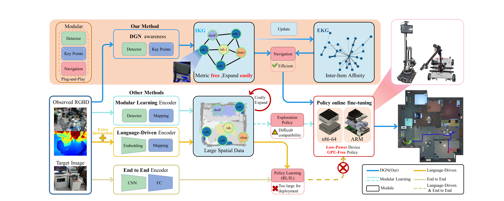

# DGN

## Knowledge-Driven Visual Target Navigation: Dual Graph Navigation

### A knowledge-driven, lightweight image instance navigation framework

Project website:[https://dogplanningloyo.github.io/DGN/](https://dogplanningloyo.github.io/DGN/)

## Abstract

Comparison between DGN and mainstream visual navigation methods. Mainstream visual navigation methods (Other methods) rely on RGBD input or driven by language, constructing semantic maps with tightly coupled perception modules, resulting in storage-consuming deployments. Our method (DGN) only utilizes RGBD input and constructs an Internal Knowledge Graph (IKG) using a plug-and-play instance-aware module, recording semantic information and topological relationships of instances while dynamically updating the External Knowledge Graph (EKG) with object category correlation. This enables efficient navigation that is deployable on low-power, low-computation edge devices.

## Demonstration

<video width="1080" height="720" controls>
    <source src="./Material_files/process_visual.mp4" type="video/mp4">
    Your browser does not support the video tag.
</video>
This is a visualisation of the construction process of IKG and EKG in DGN when exploring an unknown environment.

## Simulation and Datasets

 [Ai2THor](https://ai2thor.allenai.org/) with [ProcTHOR-10k](https://github.com/allenai/procthor-10k)

 [habitat](https://github.com/facebookresearch/habitat-sim) with [Gibson](http://gibsonenv.stanford.edu/database/)

## Star

We can Ssimply run the corresponding script file to run the test.

```
cd eval_program_with_ground_truth
bash script_name.sh <number_of_programs>
```

The number_of_programs represents the number of threads started at the same time.
The test results will be saved in the **DGN_eval_file folder.
If you want to visualise the test results, you can run the following code
```
python data_deal.py
```
The visual results will be saved in the **DGN_eval_file/process_data_eval**

# DGN robot eval
If you need to run on a full-featured robot, adapted to different platforms, you can run the following code (note that it is debugged according to different performance devices and parameters to obtain performance that meets the needs)
```
cd DGN_robot
python embodied_navigation.py
```
## Citation
```Bibtex
@inproceedings{DGN,
      title={{A knowledge-driven, lightweight image instance navigation framework}},
      author={Shiyao Li, Ziyang Meng, Jiansong Pei, Jiahao Chen, Bingcheng Dong, Guangsheng Li, Shenglan Liu, Feilong Wang}
      year={2024},
      booktitle={}
}
```